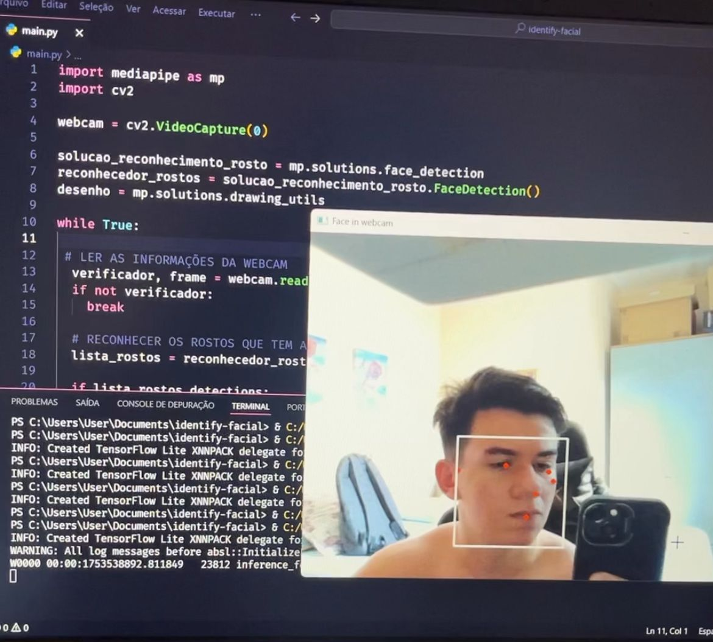

# 🧠 Identify Facial — Reconhecimento Facial com Python, MediaPipe e OpenCV

Este projeto implementa um sistema simples de **reconhecimento facial em tempo real**, utilizando a webcam do dispositivo e as bibliotecas **MediaPipe** e **OpenCV**.


> 📸 O objetivo é detectar rostos presentes na imagem capturada pela webcam e desenhar uma moldura sobre eles em tempo real.

---

# Funcionamento



---

## 🚀 Tecnologias Utilizadas

- [Python 3.10](https://www.python.org/)
- [MediaPipe](https://google.github.io/mediapipe/)
- [OpenCV](https://opencv.org/)
- [NumPy](https://numpy.org/)

---

## 🖥️ Pré-requisitos

- Python instalado (versão recomendada: **3.10**)
- Webcam funcional
- Sistema operacional: Windows, Linux ou macOS

---

## ⚙️ Instalação

### 1. Clone o repositório

```bash
git clone https://github.com/Davidsouzaxz/identify-facial.git
cd identify-facial

```

---

__Feito com ☕ e muito Python🐍__